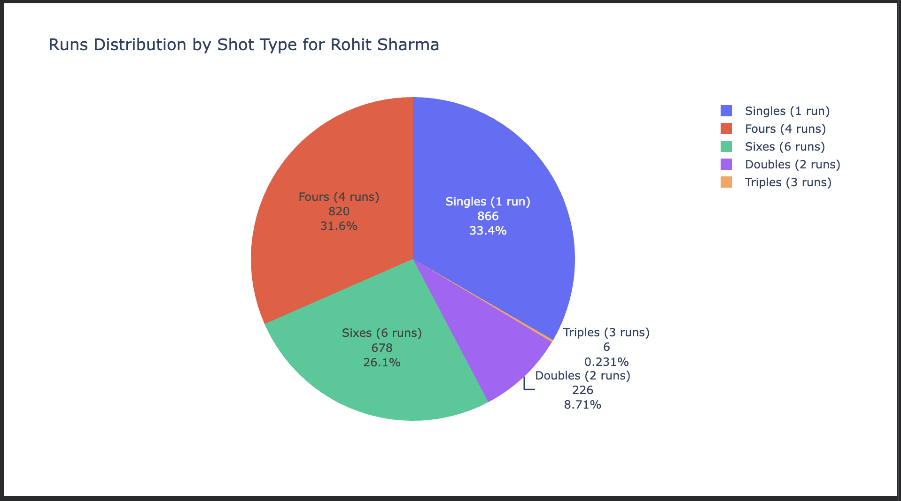
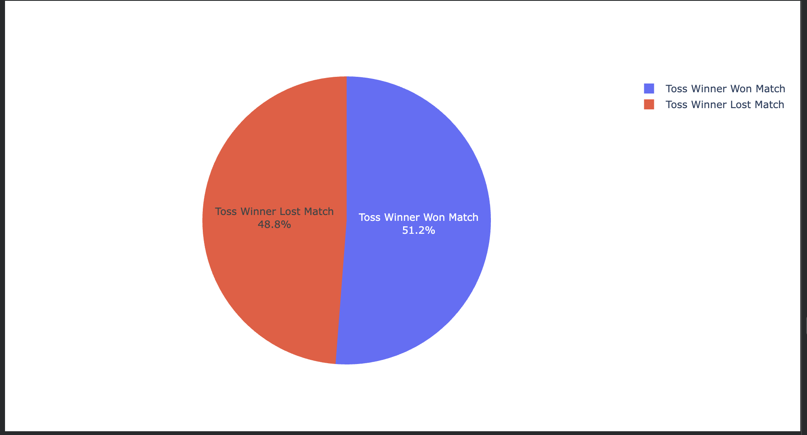
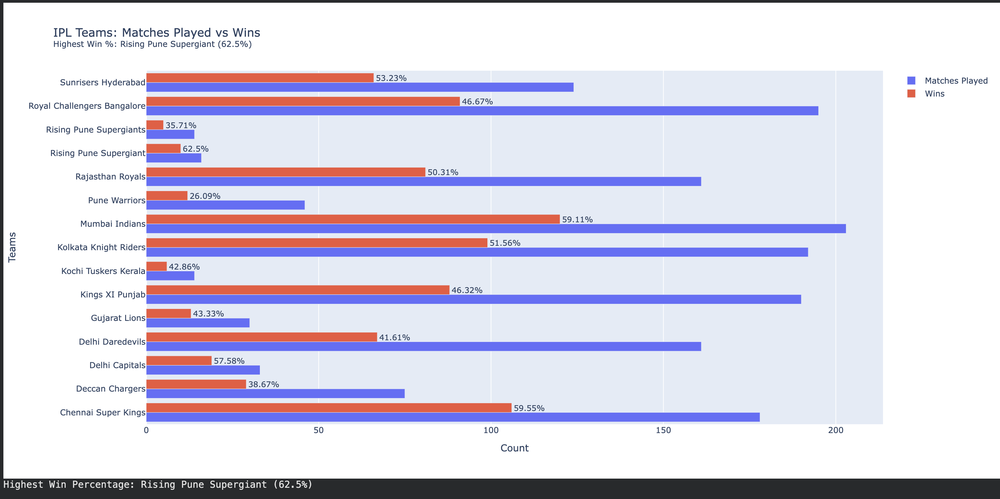

# 🏏 IPL Data Analytics Case Study

A comprehensive exploratory data analysis (EDA) of Indian Premier League (IPL) matches from **2008 to 2020**, covering player-level performance, toss-outcome relationships, and team win statistics.

---

## 📁 Dataset

| File | Description |
|------|-------------|
| `IPL_Matches_2008-2020.csv` | Match-level data — teams, venues, toss results, winners, player of the match |
| `IPL_PER_MATCH_DATA_2008_2020.csv` | Ball-by-ball delivery data — batsman runs, dismissal kinds, extras, etc. |

---

## 🛠️ Tech Stack

- **Python 3**
- `pandas` — data manipulation
- `numpy` — numerical operations
- `matplotlib` & `seaborn` — static visualisation
- `plotly` — interactive charts

---

## 📂 Project Structure

```
IPL_Data_Analytics/
│── /plots                                # Plots of the analysis
├── IPL_DATA_ANALYTICS_CASE_STUDY.ipynb   # Main analysis notebook
├── IPL_Matches_2008-2020.csv             # Match-level dataset
├── IPL_PER_MATCH_DATA_2008_2020.csv      # Delivery-level dataset
└── README.md
```

---

## 📊 Analysis Sections

---

### Section 1 — Rohit Sharma Batting Analysis

An in-depth breakdown of how Rohit Sharma (RG Sharma) scored his runs across IPL seasons — categorised by shot type: singles, doubles, triples, fours, and sixes.

**Key steps:**
- Filtered the ball-by-ball dataset for all deliveries faced by Rohit Sharma
- Calculated the total runs contributed by each scoring category
- Examined dismissal patterns to understand how he gets out

**Visualisation — Pie Chart: Runs Distribution by Shot Type**

> 📷 *Add your plot here*
>
> 

#### ✅ Conclusion

> Most of Rohit Sharma's runs come from **singles and boundaries (fours and sixes)**, reflecting a batting style that balances effective strike rotation with aggressive power hitting. Contributions from doubles and triples are minimal, suggesting a strong reliance on boundary scoring for big scoring bursts, supplemented by consistent accumulation through singles. This classic "anchor-and-accelerate" profile makes him one of the most efficient run-scorers in IPL history.

---

### Section 2 — Does Winning the Toss Imply Winning the Match?

An investigation into whether the team that wins the toss has a statistically meaningful advantage in winning the match across all IPL seasons from 2008–2020.

**Key steps:**
- Compared `toss_winner` vs `winner` columns across all matches
- Created a new flag column `toss_win_game_win` (Yes/No)
- Counted the distribution and plotted it as a pie chart

**Visualisation — Pie Chart: Toss Win vs Match Win**

> 📷 *Add your plot here*
>
> 

#### ✅ Conclusion

> Winning the toss provides only a **marginal advantage** — the split between toss winners going on to win the match and those who don't is close to 50-50. This indicates that while a toss win might influence strategic decisions (batting first vs. chasing), it does **not strongly determine** the final result. Overall team quality, player form, and in-game execution are far more significant factors in deciding IPL outcomes.

---

### Section 3 — Team Win Statistics & Win Percentages

A comparative analysis of all IPL franchises — measuring how many matches each team played, how many they won, and computing their overall win percentage to identify the most consistently dominant team.

**Key steps:**
- Aggregated total matches played per team from both `team1` and `team2` columns
- Counted total wins per team from the `winner` column
- Merged the two DataFrames and computed win percentage
- Visualised results as a grouped horizontal bar chart

**Visualisation — Grouped Bar Chart: Matches Played vs Wins (with Win %)**

> 📷 *Add your plot here*
>
> 

#### ✅ Conclusion

> Among all IPL franchises, the team with the **highest win percentage** stands out as the most dominant across the 2008–2020 period. While teams like **Mumbai Indians** have accumulated the most wins in absolute numbers due to longevity, win percentage normalises for the number of appearances — giving a fairer picture of overall performance. Teams with fewer seasons show varied efficiency, highlighting how **squad consistency and management strategy** play a pivotal role in sustained IPL success.

---

## 🔍 Basic Match-Level Insights (Exploratory)

Before the three main analyses, a quick exploration of the match dataset revealed:

- **Total matches played** across all seasons (2008–2020)
- Unique **venues and cities** that hosted IPL matches
- All **franchises** that participated in the league
- Teams with the **most toss wins**
- The player who won the **most Player of the Match** awards

---

## 🚀 How to Run

1. Clone or download this repository.
2. Place both CSV datasets in the `/content/` directory (or update paths in the notebook).
3. Install dependencies:
   ```bash
   pip install pandas numpy matplotlib seaborn plotly
   ```
4. Open and run the notebook:
   ```bash
   jupyter notebook IPL_DATA_ANALYTICS_CASE_STUDY.ipynb
   ```

---

## 📌 Notes

- The dataset covers IPL seasons **2008 to 2020** only. Seasons after 2020 are not included.
- Rohit Sharma is referenced in the dataset as **`RG Sharma`**.
- All interactive plots are built with **Plotly** and are best viewed inside Jupyter Notebook or JupyterLab.

---

## 👤 Author

> *Add your name and contact here*

---

## 📄 License

This project is for educational and analytical purposes only. IPL data used is publicly available.